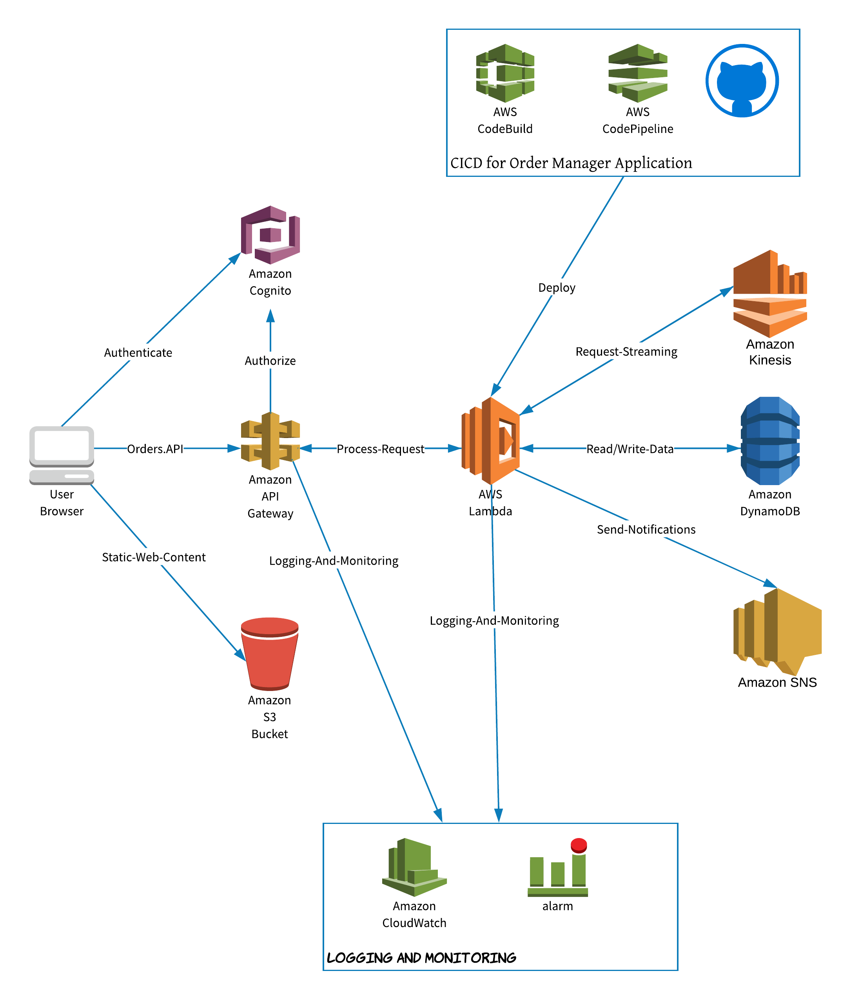

# Order Manager Application

### AWS Architecture Diagram



### Docker Image Build
```bash
docker build -t devbhuwan/order-manager-image -f infrastructure/Dockerfile .
```


### Setup
```bash
npm install cim -g
npm install kms-cli -g
```
- To encrypt key
```bash
export AWS_REGION=us-east-1
export AWS_PROFILE=default
kms-cli encrypt -k my_kms_key_id --pt 'My plain text'
```
- To setup ci/cd pipeline
```bash
cim stack-up --profile=default
```

### Life Cycle of an API

API -> STAGING -> PROD(v1)
               -> PROD(v2) 
               